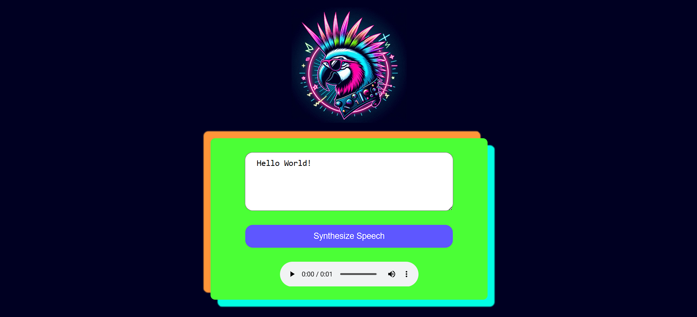

# Amazon Polly Demo

This project was done to better familiarize myself with Amazon Polly - one of the AI services available in AWS. It uses the free tier of polly so there should be no charges (if you follow the guidelines for AWS free tier).

Steps to replicate : 

- download the application code
- NPM install
- change .env.example to just .env
- log into your AWS user account (not the root account, a utility account), click your username in the corner, security credentials, scroll down to access keys, create access key, copy into .env where VITE_AWS_ACCESS_KEY_ID is your access key id, VITE_AWS_SECRET_ACCESS_KEY is the secret key and VITE_AWS_REGION is the region you create it for (you can see this in the dashboard once created too)
- ***Note***: the other two variables in the .env file are for if you want to persist voice synth files to an S3 bucket and to change your vite port (I changed the port when locally developing to make it harder to find my s3 bucket.) 
- npm run dev

Thats it!

**Good links to look at**:
- https://docs.aws.amazon.com/sdk-for-javascript/v3/developer-guide/polly-examples.html
- https://aws.amazon.com/polly/getting-started/
- https://docs.aws.amazon.com/polly/latest/dg/getting-started.html