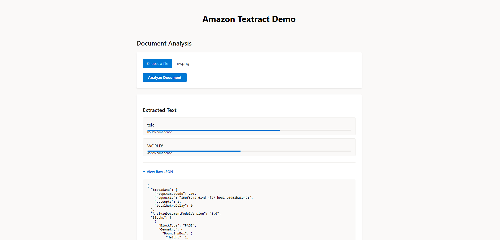

# Amazon Textract

This project was done to better familiarize myself with Amazon Textract - one of the AI services available in AWS. It uses the free tier of textract so there should be no charges (if you follow the guidelines for AWS free tier).

Textract scans documents for text, form's for key / value pairs, handwriting analyses, table data and even allows for queries such as 'what is the customers name on this invoice?'. You can also scan U.S. based ID's and has special services for handling Mortgage data.

Notes: The textract api returns a JSON object with data pertaining to your search - in this case I sent it a picture I made in ms paint that says hello world!

(See Bottom)

Here is a breakdown of the information it sent back:

First it sends you information regarding the request : status code, unique id, attempts and retry data. Then it sends you information on the 'blocks' associated with this document. Blocks are chunks of information that is associated with this document. There is one 'page' block and 2 'line' blocks that are identified by there id's as children of the page block. Line blocks are broken down geo-spatially, meaning that it could/would/should pick out an element like a button and return it as a line block. The line block has info on the complete text associated with it as well as spacial information (like what % from the edge of the page the line is) concerning where it was positioned on the document and how big it is. It also returns information on the word blocks associated with it in the 'relationships' array associated with the line block. Word blocks contain information on the individual words associated with line blocks as well as information on the type of text (in this case identified as 'handwriting'). Additionally, every block has as confidence score associate with how sure the analyses is.

In addition to document breakdowns like the one described above you can use textract to pull specific information from documents using predefined queries pertaining to common documents like invoices, recept, w2s and bank statements or even write your own custom queries although they are outside the scope of the AWS free tier.

