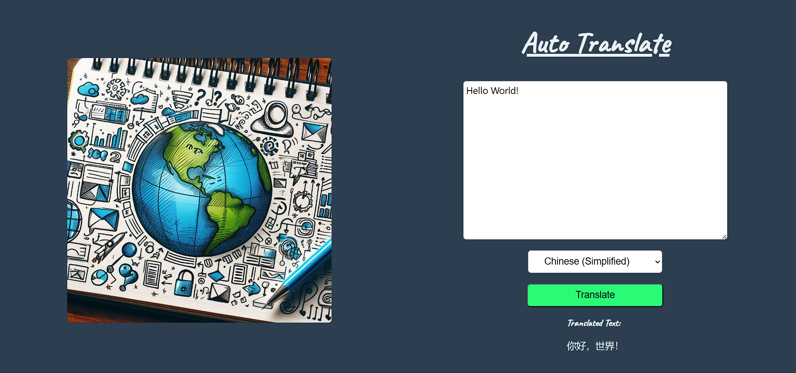

# Amazon Translate

This is a basic usecase for AWS translate - it takes some text, auto detects its language of origin then translates it to a language specified in the dropdown.

Trying with a cdn to speed up development - I added React and AWS SDK through a CDN - that was to speed up local development and not have any overhead just to try out some AWS AI offerings.

Note: You need to update fake-config.js to be just config.js and change the keys and region yourself.

Need to have a way to serve this otherwise will get errors so I am using http-server (npm install -g http-server then in the console type http-server to start)
